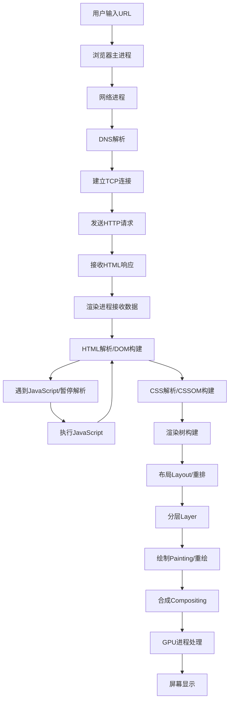
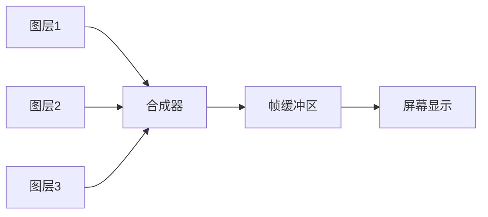

# 浏览器工作原理
## 1 进程架构
首先明确：**浏览器是"多进程"架构**（每个进程有独立内存空间，互不干扰），而每个进程内部包含多个"线程"（共享进程内存，协同工作）。

### 核心进程
浏览器的核心进程（4个核心进程）

| 进程名称         | 作用                                                                 |
|------------------|----------------------------------------------------------------------|
| 浏览器进程（主进程） | 管理窗口、用户交互（如地址栏输入）、网络请求调度、进程间通信（IPC）。 |
| 渲染进程（标签页进程） | 核心进程！负责页面渲染（HTML/CSS/JS 解析）、执行 JS、处理 DOM 等（每个标签页默认一个，同域名可能合并）。 |
| GPU 进程         | 处理 GPU 加速任务（如 3D 渲染、图层合成、视频播放），避免阻塞渲染进程。 |
| 插件进程         | 运行浏览器插件（如 Flash、Chrome 插件），独立进程防止插件崩溃影响其他进程。 |
### 核心线程
渲染进程是前端最关注的，内部包含 **5个核心线程**（各司其职，协同工作）：

- **渲染进程有一个核心主线程**，它既是 "JS 引擎线程" 也是 "GUI 渲染线程"，二者**互斥运行**而非并行
- 渲染流水线还包括**合成线程**和**栅格线程**等辅助线程，负责渲染的后期阶段，与主线程协同工作

| 线程名称               | 作用                                                                 | 关键特性                                                                 |
|------------------------|----------------------------------------------------------------------|--------------------------------------------------------------------------|
| JS 引擎线程（V8 线程） | 执行 JS 代码（同步代码）、管理调用栈。                                 | 单线程！同一时间只能执行一个任务（避免 DOM 冲突），与 GUI 渲染线程互斥。   |
| GUI 渲染线程           | 执行渲染流程（解析 HTML/CSS、生成渲染树、布局、绘制）。               | 与 JS 引擎线程互斥：JS 执行时 GUI 会暂停，GUI 执行时 JS 会暂停（避免样式和 DOM 不一致）。 |
| 事件触发线程           | 管理"事件队列"（如点击、键盘、定时器、AJAX 回调）。                   | 独立于 JS 引擎线程，当事件触发时，将回调函数放入事件队列，等待 JS 引擎空闲时执行。 |
| 定时器线程（setTimeout/setInterval） | 管理定时器的计时和触发。                                             | 独立于 JS 引擎线程（避免 JS 阻塞导致计时不准），计时结束后将回调放入事件队列。 |
| HTTP 请求线程          | 处理 AJAX/fetch 网络请求。                                           | 独立线程，可同时发起多个请求（浏览器限制同域名最大并发数，一般 6 个），请求完成后将回调放入事件队列。 |
### 浏览器中的进程
浏览器整体：进程数 ≈ 渲染进程 * n（同域名合并）+ 主进程、GPU、插件进程：
- 主进程
- 渲染进程（一个Tab页面）
	- JS引擎
	- GUI
	- 事件线程
	- 定时器
	- HTTP
- GPU进程
- 插件进程

单个渲染进程：固定包含 5 个核心线程（JS 引擎、GUI、事件触发、定时器、HTTP 请求），可额外通过 `Web Worker` 创建新线程（见下一个问题）。

### Tab页中的线程
一个页面（对应一个渲染进程）的线程数 = **核心线程数 + 自定义线程数**

#### 核心线程
即渲染进程内的核心线程（JS 引擎、GUI、事件触发、定时器、HTTP 请求），无论页面是否复杂，这 5 个线程都存在。

#### 自定义线程
- Service Worker 线程：用于离线缓存、推送通知，属于独立于渲染进程的线程（关联页面，但在后台运行）；
- Shared Worker 线程：多个同域名页面可共享的 Worker 线程（跨页面通信）。

 原理：JS 引擎是单线程，但浏览器允许通过 `new Worker()` 创建 **后台线程**（Web Worker），用于执行耗时操作（如大数据计算、复杂逻辑处理）。
 
关键限制：
- 不能操作 DOM/CSS（无 `document`、`window` 对象），只能通过 `postMessage` 与主线程通信；
- 不能跨域加载脚本（Worker 脚本必须和页面同域名）；
- 数量限制：浏览器对单个页面的 Worker 线程数有上限（一般 20-50 个，避免占用过多资源）。

![[Pasted image 20251125142805.png]]

多进程架构的优势包括：
- 隔离性：单个标签页崩溃不影响其他页面
- 安全性：渲染进程在沙盒中与操作系统隔离开来
- 性能优化
## 2渲染原理
渲染进程在==文档加载==、样式==变化==、用户==交互==时触发
### 从输入URL地址到渲染出页面的过程


### 网络请求部分
1. **DNS解析**：将域名转换为IP地址
2. **TCP连接**：与服务器建立可靠连接（三次握手）
3. **HTTP请求**：发送请求头和数据
4. **响应处理**：接收服务器返回的HTML、CSS、JS等资源
5. **数据传输**：将响应数据传递给渲染进程进行解析
6. **预解析器**：提前下载CSS和JavaScript资源
### DOM树与CSSOM树
HTML解析：
- **令牌化 (Tokenization)**：将HTML标签转换为令牌
- **树构建**：根据标签嵌套关系构建DOM树
- **预解析优化**：主解析器工作时，预解析器提前扫描和下载外部资源

CSS解析与HTML解析并行进行
JavaScript对渲染流程的影响：
```html
<!-- 同步脚本阻塞解析 -->
<script src="app.js"></script>
<!-- 异步脚本不阻塞 -->
<script async src="app.js"></script>
<!-- 延迟执行脚本 -->
<script defer src="app.js"></script>
```
阻塞机制：
- **解析阻塞**：同步脚本会暂停HTML解析
- **渲染阻塞**：CSS和JavaScript都可能阻塞渲染，CSS不会阻塞HTML解析，但会阻塞页面渲染

#### CSS 真的和 HTML “并行”解析
- **下载阶段**：遇到 `<link rel="stylesheet">`，浏览器会立刻并行下载 CSS 文件，同时继续往下解析 HTML。所以**网络层面是并行的**。
- **解析阶段**：
  - 浏览器一边解析 HTML，一边构建 DOM 树。
  - CSS 文件下载完就会被解析成 CSSOM 树，**这个解析过程不会卡住 DOM 的构建**。
- **渲染阶段**：浏览器要画出页面，必须同时拥有 DOM 和 CSSOM。只要 CSSOM 还没好，哪怕 DOM 已经完整了，画面也出不来。这就是“**CSS 不阻塞 HTML 解析，但阻塞渲染**”的精确含义。

> 于是你会看到页面白屏，但 DOM 节点其实已经在后台生成好了（可以通过脚本验证）。

---

#### 三种 script 对解析的影响
##### 同步脚本 `<script src="app.js"></script>`
- **行为**：浏览器看到它就立刻停下手头的 HTML 解析，去下载（如果没有缓存）并立即执行这个 JS。
- **阻塞了什么？**
  - **阻塞 HTML 解析**：执行完脚本之前，后面的 DOM 节点都不会被构建。
  - **阻塞渲染**：因为解析都停了，新的 DOM 和 CSSOM 没法合成，自然也无法渲染。
- **额外依赖**：如果脚本想读取元素样式，它还必须等**排在它前面的 CSS** 加载完（否则样式信息没准备好），这会导致脚本执行延后，进一步延长解析阻塞时间。

##### 异步脚本 `<script async src="app.js"></script>`
- **行为**：下载过程完全异步，不阻塞 HTML 解析。但**一下载完就立刻执行**，此时解析可能还没结束。
- **阻塞了什么？**
  - **执行时阻塞 HTML 解析**：如果在执行那一刻解析还在进行，就会暂停解析。
  - 执行顺序**不可控**：多个 async 脚本谁先下载完谁先执行，适合独立无依赖的脚本（比如统计脚本）。
- **渲染影响**：因为执行会打断解析，也就间接推迟了渲染时机。

##### 延迟脚本 `<script defer src="app.js"></script>`
- **行为**：下载完全异步，和 async 一样不阻塞解析。但执行被推迟到**HTML 解析完全结束之后、`DOMContentLoaded` 事件之前**。
- **阻塞了什么？**
  - **不阻塞 HTML 解析**。
  - 渲染会等到 DOM 完全构建好之后再进行（通常这时 CSSOM 也已就绪），而 defer 脚本又在渲染之前执行，所以仍然可能影响首屏渲染的时机，但不会在解析中途卡住。
- **顺序保证**：多个 defer 脚本严格按在文档中的顺序执行。


#### CSS 对 JS 的“隐性阻塞”
你前面提到“CSS 不会阻塞 HTML 解析”，这没错。但**如果中间夹了一个脚本，情况就变了**：

```html
<link rel="stylesheet" href="style.css">
<script src="app.js"></script>
```

- `app.js` 如果是同步脚本，浏览器在执行它之前，会检查前面的 CSSOM 是否已构建好。
- 因为脚本可能会读取样式（例如 `element.style.color`），如果 CSSOM 没准备好，这个读操作就不准确，所以浏览器**必须等前面的 CSS 加载并解析完，才执行这个脚本**。
- 结果就是：CSS 虽然不直接阻塞 HTML 解析，但它通过阻塞脚本执行，**间接阻塞了 HTML 解析**。

所以严格来说，存在这样的情况：**CSS 会阻塞同步脚本的执行，进而阻塞 HTML 解析**。

#### 思维速记图
最后帮你把关系压缩成一张逻辑链，下次分不清的时候回想这个顺序：

1. 浏览器从上往下扫描 HTML。
2. 看到 CSS → 开启下载，同时继续解析 HTML（不阻塞 DOM 构建）。
3. 看到**同步 script** → 立即停下，等该 script 下载 + 执行；如果前面还有未完成的 CSS，得等 CSS 先完成。
4. 看到 **async script** → 继续解析，但脚本一下载完就执行，此时可能打断解析。
5. 看到 **defer script** → 继续解析，等 DOM 全完再执行。
6. 只有当 **DOM 树完成 + CSSOM 树完成**，并且**没有阻塞渲染的脚本还在跑**，浏览器才开始渲染像素。
#### 最佳实践
##### CSS 的推荐位置
**最佳实践：放在 `<head>` 里，尽早加载。**

- 虽然 CSS 不阻塞 HTML 解析，但它**阻塞页面渲染**。把 CSS 放在头部，浏览器可以立刻下载并解析，CSSOM 树能尽快构建好。
- 如果放到 `<body>` 末尾，浏览器要先渲染一个“无样式”的 DOM，等读到 CSS 后再重绘，导致页面闪烁（FOUC），用户体验极差。

**进阶优化：**
- **内联关键 CSS**：把首屏必需的样式直接写在 `<style>` 标签里，减少一次网络往返，彻底消除对首屏渲染的阻塞。
- **异步加载非关键 CSS**：用 `media="print" onload="this.media='all'"` 或 `rel="preload"` + 切换，让次要样式不阻塞初始渲染。
```html
<!-- 关键样式：内联 -->
<style>/* 首屏必须的样式 */</style>

<!-- 次要样式：异步加载，不阻塞渲染 -->
<link rel="preload" href="non-critical.css" as="style" onload="this.onload=null;this.rel='stylesheet'">
<noscript><link rel="stylesheet" href="non-critical.css"></noscript>
```

##### 同步脚本（无属性）的推荐位置
**最佳实践：移到 `<body>` 末尾，`</body>` 之前。**

- 同步脚本会**阻塞 HTML 解析**。放在末尾时，它前面几乎完整的 DOM 已经构建好了，脚本可以安全操作节点，同时不会再阻挡后续内容。
- 如果放在 `<head>` 里且没有 defer/async，页面会长时间白屏，直到脚本下载执行完才能继续解析，严重影响体验。

```html
<body>
  <!-- 页面所有内容 -->
  <script src="library.js"></script>
  <script src="app.js"></script>
</body>
```

##### defer / async 脚本的推荐位置
如今大多数脚本都应该用 **`defer`** 或 **`async`** 来解除阻塞。

| 类型 | 何时使用 | 推荐放置位置 |
|------|---------|------------|
| **defer** | 需要操作 DOM，且依赖脚本执行顺序（如框架代码、工具库、页面初始化逻辑） | 放在 `<head>` 里，可提前并行下载，不阻塞解析，执行顺序有保证 |
| **async** | 完全独立、不依赖 DOM 也不被其他脚本依赖的模块（如统计、广告、独立小工具） | 同样放在 `<head>`，下载完立刻执行，可能在任何时刻插入执行 |

**特别提醒：** ES6 模块脚本 `<script type="module">` 默认就是 defer 行为，可以安全地放在 `<head>` 中。
```html
<head>
  <!-- 依赖框架，需保持顺序，用 defer -->
  <script defer src="framework.js"></script>
  <script defer src="app.js"></script>
  
  <!-- 独立统计脚本，用 async -->
  <script async src="analytics.js"></script>
</head>
```

把上面所有优化结合起来，一个典型的“性能友好”结构如下：

```html
<!DOCTYPE html>
<html lang="zh">
<head>
  <meta charset="UTF-8">
  <title>性能优化示例</title>
  
  <!-- 1. 关键 CSS：内联，零阻塞 -->
  <style>
    /* 首屏内容的核心样式 */
  </style>
  
  <!-- 2. 非关键 CSS：使用 preload 异步加载 -->
  <link rel="preload" href="full.css" as="style" onload="this.rel='stylesheet'">
  
  <!-- 3. 框架/主逻辑脚本：defer，在 head 提前下载，最后执行 -->
  <script defer src="framework.js"></script>
  <script defer src="main.js"></script>
  
  <!-- 4. 完全独立的模块：async -->
  <script async src="https://third-party.com/tracker.js"></script>
</head>
<body>
  <!-- 所有 HTML 内容 -->
  
  <!-- 不再放同步脚本，除非有特殊需求且确认位置没问题 -->
</body>
</html>
```

### 渲染树
结合DOM和CSSOM生成渲染树：
- **仅包含可见元素**：`display: none`的元素不进入渲染树
- **样式计算**：为每个元素计算最终样式（层叠、继承）
- **可见性处理**：`visibility: hidden`的元素仍在渲染树中但不可见
### 布局Layout（重排）流程
- **布局计算**：计算每个元素在视口中的精确位置和大小（重排）
- **重排触发**：当布局变化时需要重新计算元素几何属性

1. **计算位置大小**：确定元素在视口中的确切位置和尺寸
2. **重排影响**：布局变化会导致整个渲染流程重新执行
### 分层Layer
浏览器将页面分解为多个图层进行优化渲染：
- **显式分层**：`transform`, `opacity`, `will-change`等CSS属性
- **隐式分层**：重叠内容、视频、canvas等特殊元素
- **硬件加速**：使用GPU进行图层合成，提升性能
- **层管理**：浏览器自动管理图层创建和销毁
### 绘制Paint（重绘）
将渲染树转换为屏幕像素的过程：
1. **绘制列表生成**：为每个图层生成绘制命令
2. **重绘触发**：当元素外观变化但不影响布局时发生
3. **绘制优化**：仅重新绘制受影响区域
### 光栅化raster
分块tiles：
- **图块划分**：将大图层分割为小图块（通常256x256或512x512）
- **视口优先**：优先渲染可视区域内的图块
- **渐进加载**：离视口越远的图块优先级越低
- **缓存机制**：已光栅化的图块会被缓存复用

光栅化：将矢量图形转换为位图
1. 合成器将图层分为图块
2. 光栅线程将图块转换为位图
3. GPU进程合成最终图像
### 合成
合成器线程将各个图层合成为最终图像frame：


[合成优势]：
- **独立合成**：图层变化无需重新布局和绘制
- **GPU加速**：利用显卡硬件能力提升性能
- **60fps目标**：每16.67ms完成一次完整的渲染流水线
### 绘制draw
![[Pasted image 20250922222036.png]]
[性能优化建议]：
1. **减少重排reflow**：批量DOM操作，使用文档片段，尽量减少节点的几何信息、DOM结构、宽高、字体大小的频繁修改
2. **优化重绘repaint**：使用CSS类名切换而非直接样式修改
3. **利用合成层**：对动画元素使用transform和opacity
4. **避免布局抖动**：不要在循环中连续读取布局属性
5. **减少图层数量**：避免不必要的图层创建，防止"层爆炸"
### 现代渲染引擎优化特性
[补充说明]：现代浏览器还包含以下优化机制：
- **增量布局**：只重新计算变化部分的布局
- **懒加载**：延迟加载视口外的图片和内容
- **预渲染**：预测用户行为提前渲染可能访问的页面
- **缓存机制**：复用已光栅化的图块和计算结果
- **并行处理**：多个渲染阶段可以并行执行提升效率