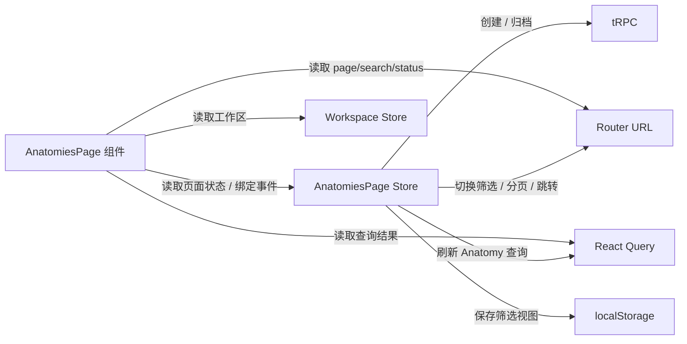

# 重构后的store
> Last Format Time：8/13/2026 15:14:03

apps\app\src\pages\AnatomiesPage 你来给我讲一下这个store是做什么的，就是将组件中的逻辑抽离到了其中吗，为什么要这个样做，这样不会很麻烦吗，而且状态管理是做这种事情的吗，讲的详细一些

是，但“把组件逻辑抽到 Store”只说对了一半。

`AnatomiesPage` 的 Store 更准确地说是一个“页面级交互控制器 / ViewModel”：

- 保存页面内部、跨组件共享的 UI 状态。
- 统一处理用户交互产生的状态变化。
- 编排创建、归档、跳转、刷新缓存、保存筛选视图等流程。
- 让组件主要负责读取状态、渲染 JSX、绑定事件。

但它没有把所有东西都塞进 Store。这个页面实际上用了四种不同的状态管理方式。

---
## 一、这个页面有哪些状态
| 状态类型   | 放在哪里                | 例子                                |
| ------ | ------------------- | --------------------------------- |
| 服务端状态  | React Query         | Anatomy 列表、加载、错误、总数               |
| URL 状态 | TanStack Router     | `page`、`search`、`status`、`create` |
| 全局应用状态 | Workspace Store     | `activeWorkspaceId`               |
| 页面临时状态 | AnatomiesPage Store | 筛选菜单、输入草稿、创建表单、保存的视图              |

这才是理解这个 Store 的关键：它没有替代 React Query、Router 或全局 Store，而是补上“页面内部交互状态”这一层。



---
## 二、Store 具体保存了什么
Store 的状态定义在 [anatomiesPageSlice.ts](G:/Save/Grogramming/CodeForge/daedalus/apps/app/src/pages/AnatomiesPage/_store/anatomiesPageSlice.ts:14)。

大致可以分成三组。

### 创建弹窗状态
```ts
createName
createPurpose
createValidationMessage
```

这些字段由创建弹窗读取：

- 输入名称时更新 `createName`
- 输入用途时更新 `createPurpose`
- 名称为空时设置 `createValidationMessage`
- 创建成功后清空字段

对应组件在 [AnatomiesCreateDialog.tsx](G:/Save/Grogramming/CodeForge/daedalus/apps/app/src/pages/AnatomiesPage/_components/AnatomiesCreateDialog/AnatomiesCreateDialog.tsx:6)。

例如组件本身没有：

```ts
const [name, setName] = useState("");
```

而是从 Store 订阅：

```ts
const name = useStore(store, state => state.createName);
```

然后把 Store 中的事件处理函数交给输入框：

```tsx
<input value={name} onChange={handleCreateNameInputChange} />
```

所以这一部分确实是把组件中的表单状态和交互逻辑抽到了 Store。

### 筛选菜单状态
```ts
filterOpen
filterPanel
nameDraft
```

分别表示：

- 筛选下拉菜单是否打开。
- 当前显示根菜单、名称筛选，还是状态筛选。
- 用户正在输入、但还没有正式提交的名称。

这里区分了两个东西：

- `nameDraft`：临时输入，放在 Store。
- 已生效的 `search`：正式筛选条件，放在 URL。

比如用户输入 `billing` 时，先更新 `nameDraft`。点击添加或按 Enter 后，Store 才调用路由，把它写入：

```text
/architecture/anatomies?search=billing
```

对应流程在 [anatomiesPageSlice.ts](G:/Save/Grogramming/CodeForge/daedalus/apps/app/src/pages/AnatomiesPage/_store/anatomiesPageSlice.ts:102)。

这是一种很常见的设计：

```text
输入中的草稿状态 → 页面 Store
已经提交的查询条件 → URL
根据查询条件获得的数据 → React Query
```

它们不能混为一谈。

### 保存的筛选视图状态
```ts
savedViews
activeViewId
editingViewId
editingViewName
```

它们支持：

- 保存当前筛选条件。
- 选择一个保存过的视图。
- 编辑视图名称。
- 删除视图。
- 标记当前激活的是哪个视图。

`savedViews` 初始化时从 `localStorage` 读取：

```ts
savedViews: dependencies.readSavedViews()
```

保存和删除时，既更新 Store，又写入 `localStorage`。相关逻辑从 [anatomiesPageSlice.ts](G:/Save/Grogramming/CodeForge/daedalus/apps/app/src/pages/AnatomiesPage/_store/anatomiesPageSlice.ts:245) 开始。

---
## 三、它抽离的不只是状态，也包含“状态转换”
Store 不只是一个数据对象：

```ts
{
  filterOpen: false,
  createName: ""
}
```

它还定义了用户操作之后应该发生什么。例如创建 Anatomy：

```ts
handleCreateDialogCreateButtonClick
```

这个方法完成了一整条业务流程：

1. 清除旧的校验信息。
2. 读取并清理名称。
3. 校验名称是否为空。
4. 构造 Anatomy draft。
5. 调用创建接口。
6. 清空表单状态。
7. 关闭创建页面状态。
8. 让 React Query 重新获取列表。
9. 跳转到新 Anatomy 详情页。

相关实现见 [anatomiesPageSlice.ts](G:/Save/Grogramming/CodeForge/daedalus/apps/app/src/pages/AnatomiesPage/_store/anatomiesPageSlice.ts:162)。

如果不抽离，这段代码大概率会出现在组件里：

```tsx
const handleCreate = async () => {
  // 校验
  // 创建
  // 清空表单
  // 关闭弹窗
  // invalidate query
  // navigate
};
```

这并不是错。页面简单时，这样反而更直接。

但随着页面功能增长，组件会同时承担：

- JSX 布局
- 表单状态
- 校验
- 路由跳转
- API 调用
- 缓存刷新
- localStorage
- 筛选状态机

组件最终会变得很难阅读。所以这里把“界面怎么显示”留给组件，把“用户操作以后发生什么”放入 Store。

---
## 四、为什么还要 Dependencies 层
[anatomiesPageDependencies.ts](G:/Save/Grogramming/CodeForge/daedalus/apps/app/src/pages/AnatomiesPage/_store/anatomiesPageDependencies.ts:28) 定义了 Store 可以使用的外部能力：

```ts
archiveAnatomy
createAnatomy
getSearch
navigateSearch
navigateToAnatomy
invalidateAnatomies
readSavedViews
writeSavedViews
translate
```

Store 不直接依赖 Router hook、Query Client hook 或浏览器存储，而是调用这些抽象能力。

页面 Wrapper 在 [AnatomiesPage.tsx](G:/Save/Grogramming/CodeForge/daedalus/apps/app/src/pages/AnatomiesPage/AnatomiesPage.tsx:10) 中获得真实的 Router 和 Query Client，然后组装 Dependencies：

```tsx
const queryClient = useQueryClient();
const router = useRouter();

const dependencies = createAnatomiesPageDependencies({
  queryClient,
  router,
  storage: globalThis.localStorage,
});
```

这叫依赖注入。最大的收益不是“代码看起来高级”，而是测试方便。

测试可以传入假的依赖：

```ts
navigateSearch: vi.fn()
createAnatomy: vi.fn(...)
writeSavedViews: vi.fn()
```

然后直接验证：

- 点击创建后是否调用了 API。
- 是否刷新了查询。
- 是否跳转到了详情页。
- 是否正确清空表单。

不需要真正启动 Router、服务器、浏览器和 React 页面。测试示例在 [anatomiesPageStore.test.ts](G:/Save/Grogramming/CodeForge/daedalus/apps/app/src/pages/AnatomiesPage/_store/anatomiesPageStore.test.ts:77)。

---
## 五、Provider 是干什么的
[provider.tsx](G:/Save/Grogramming/CodeForge/daedalus/apps/app/src/pages/AnatomiesPage/_store/provider.tsx:11) 创建 Store 实例，然后通过 React Context 提供给页面内部组件。

```tsx
<AnatomiesPageStoreProvider dependencies={dependencies}>
  <AnatomiesPageContent />
</AnatomiesPageStoreProvider>
```

这样做不是为了让 Store 全局化，反而是为了把它限制在当前页面内。

它有几个意义：

- 离开页面以后，这个 Store 可以被销毁。
- 页面之间不会共享筛选菜单和创建表单状态。
- Storybook 和单元测试可以分别创建独立实例。
- 不需要从顶层一路传递几十个 props。
- Dependencies 可以针对每个实例分别注入。

所以这是“页面作用域 Store”，不是“全局 Store”。

---
## 六、组件现在承担什么职责
以 [AnatomiesPageContent.tsx](G:/Save/Grogramming/CodeForge/daedalus/apps/app/src/pages/AnatomiesPage/_components/AnatomiesPageContent/AnatomiesPageContent.tsx:24) 为例，它仍然负责：

- 从 URL 读取分页和筛选条件。
- 用 React Query 获取 Anatomy 列表。
- 根据 loading/error/empty/data 决定渲染内容。
- 计算总页数等派生值。
- 渲染表格、按钮和弹窗。

Store 则提供事件：

```ts
handleAnatomyRowClick
handleAnatomyArchiveButtonClick
handlePreviousPageButtonClick
handleNextPageButtonClick
```

因此它不是让组件“完全无逻辑”，而是让组件更偏向展示和组合。

---
## 七、这样不会很麻烦吗
会，而且这份代码已经能看出明显的成本。

例如组件中有大量这样的代码：

```ts
const handleClearFiltersButtonClick = useStore(
  store,
  state => state.handleClearFiltersButtonClick,
);
```

另外还多出了：

- Slice 文件
- Store 文件
- Provider 文件
- Dependencies 文件
- 桶导出
- 很多事件方法
- 在多个文件之间跳转的认知成本

而且当前只有一个 `anatomiesPageSlice`，所以“Store 和 Slice 分成两个文件”在技术上并不是必需的。它主要是项目统一规范，以及未来能继续组合其他 Slice。

因此答案不是“Store 永远比组件内状态好”，而是看页面复杂度。

适合使用页面 Store 的情况：

- 同一个状态被多个兄弟组件使用。
- 一个交互会同时修改多个状态。
- 操作包含 API、路由、缓存、持久化等多个步骤。
- 出现明显的 props drilling。
- 业务流程需要脱离 React 进行单元测试。
- 页面已经形成复杂的交互状态机。

更适合 `useState` 的情况：

- 状态只属于一个小组件。
- 只有打开/关闭之类的简单状态。
- 没有跨组件共享。
- 组件卸载后状态直接消失即可。
- 抽离后代码量和理解成本反而更高。

例如一个独立 Tooltip 的 `open` 状态，没有必要放进页面 Store。创建弹窗的三个字段目前只被一个组件消费，严格来说也可以使用 `useState` 或 `react-hook-form`；之所以放进 Store，是因为它的提交过程还连接了路由、API、缓存刷新和页面跳转。这是一种架构取舍，并非唯一正确答案。

---
## 八、状态管理是不是应该做这些事情
狭义的状态管理只负责：

```text
保存状态 + 修改状态
```

但工程中的 Zustand Store 通常有两种风格。

第一种是纯状态 Store：

```ts
name: ""
setName(name)
```

业务流程仍写在组件或自定义 Hook 中。

第二种是当前项目采用的 Store：

```ts
状态 + 用户事件 + 业务流程编排
```

所以这里的 Store 更接近：

```text
Zustand Store + 页面 Controller + ViewModel
```

这符合当前仓库 `store-best-practice` 的约定：Slice 是页面业务流程中心，可以调用数据、路由、通知和持久化能力，但不能依赖 React hooks 或 JSX。

我的评价是：对于 `AnatomiesPage` 这种同时包含列表、筛选、保存视图、编辑视图、创建、归档、分页和路由联动的页面，使用页面级 Store 是有价值的。但这套写法确实偏重，不能机械地复制到每一个小页面、每一个小组件。

一句话总结：

> 这个 Store 不是单纯把组件逻辑搬家，而是在组件之外建立一个页面级交互模型；它用更多文件和间接性，换来了跨组件共享、一致的状态转换、业务流程集中，以及更容易测试。是否值得，要看页面复杂度，而不是“用了 Zustand 就一定更好”。