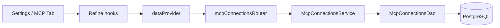
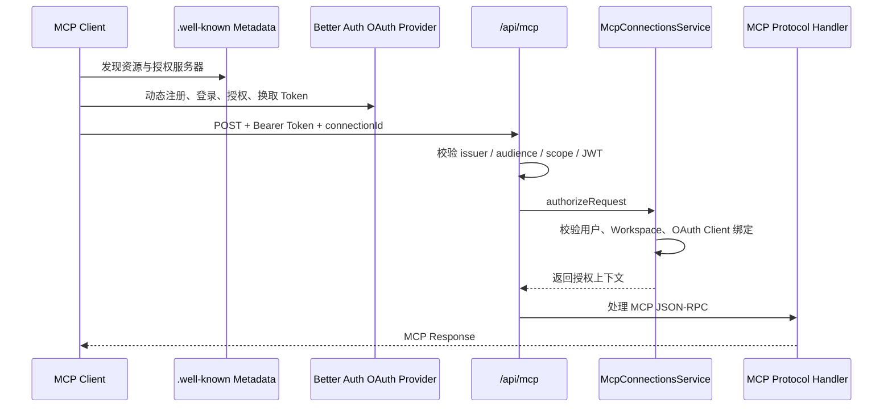

# COD-305 安全接入 MCP：实现复盘
> Last Format Time：8/13/2026 15:14:03

> 对应设计草稿：[[我的实现方案]]
>
> 本文记录本次未提交实现实际改了什么、为什么这样改，以及后续维护时最需要关注的代码位置。

---
## 一句话总结
这次改动把代达罗斯变成了一个受 OAuth 2.1 保护的远程 MCP Server，并在设置页补齐了连接的创建、安装引导、状态检查与撤销流程。

真正的核心不是新增一个 MCP Tab，而是建立了三条安全边界：

1. OAuth Token 中的用户、OAuth Client 与 `connectionId` 必须属于同一条连接。
2. MCP 连接始终受 Workspace 存在性、归档状态和成员权限约束。
3. 撤销连接时必须同时禁用 OAuth Client、清理 Token/Consent，并把业务连接置为不可恢复的 `revoked`。

---
## 整体数据流
### 创建与展示连接


前端继续遵循项目既有的数据流：页面不能直接调用 tRPC，而是经由 Refine 的 `useList`、`useOne`、`useCreate`、`useCustomMutation` 访问 `dataProvider`，再映射到 tRPC。

### MCP 客户端发起请求


---
## 改动地图
| 层级 | 主要位置 | 改动 | 为什么 |
| --- | --- | --- | --- |
| 共享 Schema | `packages/schemas/src/mcp-schema.ts` | 集中定义客户端类型、连接状态、失败码、创建输入、连接实体和安装描述 | Zod 是跨层单一数据源，避免前端、服务层和数据库重复手写联合类型 |
| 数据库 | `packages/db-schema/src/tables/mcp_connections_table.ts` 与 OAuth/JWKS 表 | 增加业务连接表，并接入 Better Auth OAuth Provider 所需表 | 业务连接生命周期与 OAuth 授权材料都需要持久化，但职责不同 |
| DAO | `packages/models/src/daos/mcpConnectionsDao/` | 封装查询、创建、绑定 OAuth Client、状态更新和批量失效 | 数据访问集中，Service 不直接拼 Drizzle 查询 |
| Repository | `packages/models/src/repositories/mcpAuthorizationRepository/` | 用事务完成 OAuth 撤销 | 撤销涉及多张表，必须保持原子性 |
| Service | `packages/services/src/mcp-connections-service.ts` | 实现创建、列表、详情、复查、授权、失败记录和撤销 | 连接的安全规则与状态机属于业务层 |
| 安装描述 | `packages/services/src/mcp-setup-service.ts` | 按 Codex、Claude Code、OpenCode、通用客户端生成命令、文档地址和 AI Prompt | 客户端差异集中在一处，UI 只负责展示 |
| OAuth | `apps/app/src/integrations/better-auth/auth.ts` | 接入 `oauthProvider`，开放动态客户端注册，声明 `mcp:connect` Scope | 让标准 MCP Client 能自动发现并完成 OAuth 2.1 流程 |
| MCP 接口 | `apps/app/src/integrations/mcp/` 与 `routes/api/mcp.ts` | 元数据、JWT 验证、业务授权、协议处理与传输限制 | 把协议逻辑从文件路由中抽离，路由只做 HTTP 映射 |
| API 适配 | `integrations/trpc/routers/mcp-connections.ts`、`integrations/refine/dataProvider.ts` | 暴露连接 CRUD/动作并接入 Refine | 保持项目既有的前端数据获取约束 |
| 页面 | `pages/AiReviewsSettingsPage/`、`pages/McpSetupPage/`、`pages/McpConsentPage/` | 增加 MCP Tab、业务组件、安装页和授权确认页 | 覆盖连接的完整用户旅程 |
| i18n | `integrations/i18n/locales/en.json`、`zh.json` | 为 MCP 页面与状态补充中英文文案 | 页面不再硬编码用户可见文本 |
| 测试与预览 | 各组件旁的 `*.test.tsx`、`*.stories.tsx` 以及 Service/协议测试 | 覆盖状态、交互、映射和协议行为 | 异步状态与安全分支需要可回归验证 |

---
## 关键实现一：领域 Schema 合并
所有 MCP 领域 Schema 最终合并到：

```text
packages/schemas/src/mcp-schema.ts
```

该文件同时导出：

- `McpClientTypeValues`：`codex`、`claude_code`、`opencode`、`generic`。
- `McpConnectionStatusValues`：`pending`、`active`、`failed`、`unavailable`、`revoked`。
- `McpConnectionFailureCodeValues`：配置、Token、OAuth Client、协议和 Workspace 相关失败码。
- 创建输入、连接实体、连接详情和安装描述 Schema。
- 全部通过 `z.infer` 生成 TypeScript 类型。

最初把 Schema 拆成许多小文件会导致一个领域的上下文被打散，导航成本高，也与项目已有的 `crate-schema.ts` 等模式不一致。因此改为“按领域聚合”，同时把这条规则写进了根目录 `AGENTS.md`。

---
## 关键实现二：连接状态不是简单的在线/离线
连接状态的含义如下：

| 状态 | 含义 | 典型进入条件 |
| --- | --- | --- |
| `pending` | 连接记录已创建，但还没有 OAuth Client 完成首次请求 | 用户刚创建连接 |
| `active` | OAuth Client 已绑定，最近一次授权检查通过 | 合法 MCP 请求到达 |
| `failed` | 配置、Token、OAuth Client 或协议失败 | OAuth Client 失效、协议返回错误 |
| `unavailable` | 外部依赖不可用 | Workspace 被归档或用户失去成员权限 |
| `revoked` | 用户主动永久撤销 | 撤销事务完成 |

这里刻意区分了 `failed`、`unavailable` 和 `revoked`：

- `failed` 通常可通过修复客户端配置或重新连接恢复。
- `unavailable` 是 Workspace 权限边界导致的不可用。
- `revoked` 是终态，`recheck` 不允许把它重新激活。

`packages/services/src/workspaces-service.ts` 也增加了联动：归档 Workspace 时批量把相关连接标为 `workspace_archived`；移除成员时，把该成员拥有的相关连接标为 `workspace_access_lost`。这样权限变化不会留下仍显示为 active 的连接。

---
## 关键实现三：OAuth Client 与业务连接的一对一绑定
关键方法位于：

```text
packages/services/src/mcp-connections-service.ts
  -> authorizeRequest()
```

一次 MCP 请求被允许前，会依次检查：

1. `connectionId` 对应的连接存在。
2. Token 的 `sub` 与连接的 `ownerUserId` 一致。
3. 连接未被撤销。
4. Workspace 未归档，且用户仍是成员。
5. 如果连接已经绑定 `oauthClientId`，本次 Token 中的 Client 必须与之相同。
6. 同一个 OAuth Client 不能绑定到另一条 MCP 连接。
7. 首次合法请求会原子式地绑定 OAuth Client，并把连接更新为 `active`。

数据库中的唯一索引 `mcp_connections_oauth_client_unique` 是最后一道并发保护。Service 的预检查负责返回可理解的业务错误，唯一索引负责阻止并发请求绕过检查。

---
## 关键实现四：OAuth 2.1 与 MCP 元数据发现
Better Auth 服务端新增 `oauthProvider` 插件，并声明：

- 授权页：`/mcp/consent`。
- Scope：`mcp:connect`。
- Audience：`/api/mcp` 的完整资源 URL。
- 允许 MCP Client 动态注册。
- 默认和允许注册的 Scope 都限制为 `mcp:connect`。

同时增加以下发现端点：

```text
/.well-known/oauth-authorization-server
/.well-known/oauth-authorization-server/api/auth
/.well-known/openid-configuration
/.well-known/oauth-protected-resource/api/mcp
```

`mcp-request-handler.ts` 使用 OAuth Provider 提供的包装器校验：

- JWT 签名与 JWKS。
- `issuer`。
- `audience`。
- `mcp:connect` Scope。

通过标准 JWT 校验后，才进入项目自己的 `authorizeRequest()` 业务授权。也就是说：OAuth 验证回答“这是谁、Token 是否有效”，业务 Service 回答“这个身份是否能访问这条连接和对应 Workspace”。两者不能互相替代。

### 两个 `auth` 类型错误为什么会出现
原实现直接把完整的 `auth` 实例传给：

```ts
oauthProviderAuthServerMetadata(auth)
oauthProviderOpenIdConfigMetadata(auth)
```

Better Auth 插件组合后，`auth` 的推导类型非常复杂，而元数据 helper 实际只依赖两个 API 方法。直接传完整实例时，库之间的泛型接口没有被 TypeScript 视为完全兼容。

修复方式是在 `oauth-metadata.ts` 中构造最小适配对象：

```ts
const oauthMetadataAuth = {
  api: {
    getOAuthServerConfig: auth.api.getOAuthServerConfig,
    getOpenIdConfig: auth.api.getOpenIdConfig,
  },
};
```

再把 `oauthMetadataAuth` 传给两个 helper。这样既没有使用类型断言掩盖错误，也把依赖面缩小到了 helper 真正需要的方法。

如果错误曾经自行消失，常见原因是 Vite/TypeScript Language Service 在依赖类型、生成文件或缓存更新后重新推导了类型；但最小适配对象仍然更稳定，也能避免未来升级插件时重新触发整实例的类型冲突。

---
## 关键实现五：MCP HTTP 入口
`/api/mcp` 的方法映射是：

- `POST`：处理 MCP JSON-RPC 请求。
- `DELETE`：交给 MCP handler 处理会话/连接结束语义。
- `GET`：返回 `405`，明确不支持 Server-Sent Events，提示客户端使用 POST。

当前协议能力声明为：

```ts
capabilities: { tools: {} }
```

这意味着本次先完成安全接入、发现和授权边界，还没有开放实际 MCP Tools。安装页和授权页也明确提示“当前未授予工具执行权限”，避免 UI 暗示出尚未实现的能力。

---
## 关键实现六：撤销必须是事务
撤销逻辑位于：

```text
packages/models/src/repositories/mcpAuthorizationRepository/
```

同一个数据库事务中会：

1. 校验连接属于当前用户且尚未撤销。
2. 禁用 OAuth Client。
3. 删除 Access Token。
4. 将 Refresh Token 标记为 revoked。
5. 删除 Consent。
6. 把业务连接更新为 `revoked`，记录 `revokedAt`。

如果这些操作分散执行，任一步骤失败都可能造成“界面显示已撤销但 Token 还能用”或“Token 已删但连接状态仍 active”的不一致。因此这部分放在 Repository 中用事务处理，而不是堆在 tRPC Router 或页面里。

---
## 关键实现七：前端页面与组件归属
设置页新增 `mcp` Tab，入口仍在 `AiReviewsSettingsPageContent`。Tab 内容由 `McpConnectionsPanel` 负责，它组合了：

- `CreateMcpConnectionDialog`：填写名称、客户端类型和 Workspace。
- `McpConnectionList`：展示连接及其状态。
- `McpConnectionDetailsDialog`：查看时间、失败原因和安装信息，并执行复查。
- `RevokeMcpConnectionDialog`：二次确认永久撤销。

这些组件只服务于设置页，因此最终放在：

```text
apps/app/src/pages/AiReviewsSettingsPage/
```

而不是全局 `components/`。只有真正跨页面复用的基础组件才应该放进 `components/`。

`McpSetupGuide` 同样属于安装流程，放在 `pages/McpSetupPage/` 下；详情弹窗虽然复用了它，也不意味着它已经成为全局通用组件。这个目录判断规则也已经写进 `AGENTS.md`。

---
## 关键实现八：Refine 状态与页面交互
`McpConnectionsPanel` 使用：

- `useList` 获取连接列表，并用返回的 `query` 控制 Loading、Error 和重试。
- `useOne` 按需加载选中连接的详情。
- `useCreate` 创建连接。
- `useCustomMutation` 执行 `recheck` 和 `revoke`。
- `useInvalidate` 在写操作后统一失效列表和详情缓存。

这保证 UI 层不直接依赖 tRPC，同时保持列表、详情和弹窗状态一致。创建成功后会直接打开新连接详情，让用户继续完成安装。

设置页的视觉样式沿用了相邻 Tab 的：

- 浅绿色说明条。
- 卡片边框、标题字号和间距。
- 项目已有的 `Button`、`Dialog`、`Table`、`Badge`、`Tabs` 等 UI 组件。

---
## 关键实现九：安装页与授权页为什么拆开
### 安装页
`/mcp/setup` 和 `/mcp/setup/$connectionId` 是公开路径，因为外部客户端或 AI 需要在没有 Web Session 的情况下读取配置说明。安装描述只包含：

- MCP Endpoint。
- 文档地址。
- 客户端命令或配置片段。
- 不含明文凭证的 AI Prompt。

它不会暴露 Token、Client Secret 或 Cookie。

### 授权页
`/mcp/consent` 没有加入公开路径，因为用户同意 OAuth 授权前必须先登录。页面从 URL 读取 `client_id` 和 `scope`，加载公开客户端信息，并让用户明确允许或拒绝。

为了让授权页能安全进入 Storybook，`McpConsentPageContent` 把三个外部依赖变成了可选注入项：

- `clientLoader`。
- `consentSubmitter`。
- `search`。

生产环境不传 Props 时仍使用真实 Better Auth 和 `location.search`；Storybook 注入内存实现，因此不会真的发起 OAuth 请求。这里的依赖注入不是为了业务复用，而是为了让带副作用的页面可隔离预览和测试。

---
## i18n 改动
MCP Tab、状态、失败原因、创建/详情/撤销弹窗、安装页和授权页的用户文案都进入了：

```text
apps/app/src/integrations/i18n/locales/zh.json
apps/app/src/integrations/i18n/locales/en.json
```

动态强调文本使用 `Trans`，日期使用当前 i18n locale 交给 `Intl.DateTimeFormat` 格式化。代码中的协议值、数据库状态值和错误分类仍保持英文，因为它们是机器可读标识，不是直接展示文案。

---
## Storybook 与测试
页面专用组件旁新增了 Storybook Stories，覆盖基础态、空态、失败态、提交态和复查态。`McpConsentPage` 额外覆盖：

- 正常授权信息。
- Loading。
- OAuth Client 加载失败。
- 两种客户端并排的 `BaseUsage`。

本次验证记录：

- `apps/app` 的 `bun run quality` 通过。
- 29 个测试文件、101 个测试通过。
- Storybook 静态构建成功。
- Storybook 验证产生的临时静态目录已清理。

---
## 后续检查清单
- [ ] 确认 `0014_cod_305_mcp_connections.sql` 已实际部署到目标 Neon 数据库；当前代码和迁移文件存在不等于生产数据库已经更新。
- [ ] 在真实 Codex、Claude Code 或其他 MCP Client 上跑一遍动态注册、登录、Consent、Token Exchange 和 MCP initialize 的端到端流程。
- [ ] 验证撤销后旧 Access Token 立即无法调用 `/api/mcp`，Refresh Token 也无法续期。
- [ ] 验证 Workspace 归档或成员移除后，已有连接立即进入 `unavailable`，接口返回 403。
- [ ] 开放实际 MCP Tools 前，为每个 Tool 单独设计 Workspace 数据权限和审计记录，不能只依赖连接级授权。

---
## 本次沉淀到项目规范的规则
根目录 `AGENTS.md` 新增了两类规则：

1. 页面专用业务组件放在对应的 `pages/<PageName>/`，不要放在全局 `components/`。
2. Schema 优先按领域聚合，同一领域的枚举、输入、实体、详情和 `z.infer` 类型放在同一个 `<domain>-schema.ts`，不要机械地“一 Schema 一文件”。

这两条规则来自本次返工，目的是让下一次实现从一开始就符合项目已有结构，而不是完成功能后再搬目录、合并文件。
