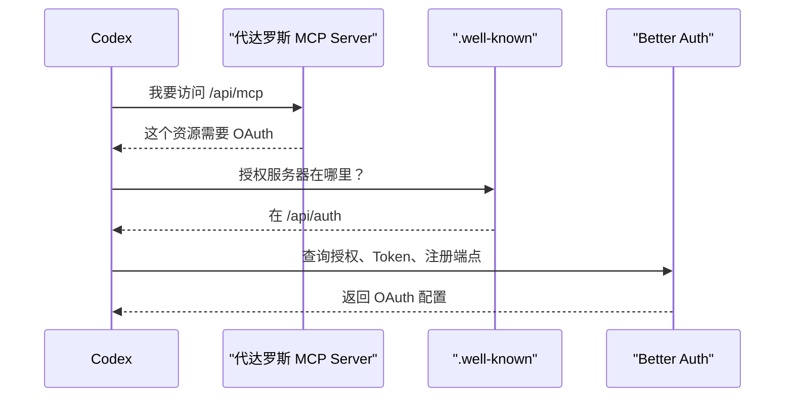
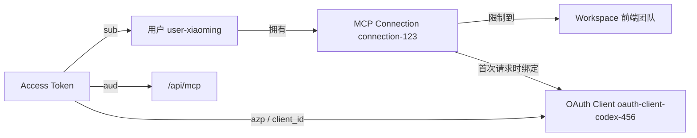

# MCP与OAuth
> Last Format Time：8/13/2026 15:14:03

你可以先把它理解成：

> MCP 负责“客户端和代达罗斯用什么协议说话”，OAuth 负责“这个客户端有没有资格进来”。

MCP 像业务接口，OAuth 像门禁系统。两者是叠在一起的，不是同一个东西。

---
## 先认识几个角色
假设你要让 Codex 连接代达罗斯：

|角色|在这次实现里是什么|
|---|---|
|用户|登录代达罗斯的你|
|MCP Client|Codex、Claude Code、OpenCode|
|MCP Server|代达罗斯的 `/api/mcp`|
|OAuth 授权服务器|Better Auth，Issuer 是 `/api/auth`|
|MCP 连接记录|`mcp_connections` 表里的一条业务数据|
|OAuth Client|Codex 在 OAuth 流程中注册出来的客户端身份|

这里最容易混淆的是“连接记录”和“OAuth Client”。

它们不是同一个东西：

- MCP 连接记录是用户在设置页创建的业务对象。
- OAuth Client 是 Codex 在 OAuth 协议中注册得到的身份。
- 第一次请求成功时，系统才把两者绑定起来。

---
## 用一个具体例子走完整流程
假设：

- 用户：小明
- MCP 客户端：Codex
- Workspace：前端团队
- 连接名称：Codex 日常开发

### 第一步：在设置页创建连接
小明在 MCP Tab 中填写：

```text
名称：Codex 日常开发
客户端：Codex
Workspace：前端团队
```

前端调用链是：

```text
McpConnectionsPanel
    ↓ useCreate
Refine dataProvider
    ↓
mcpConnectionsRouter.create
    ↓
McpConnectionsService.create
    ↓
McpConnectionsDao.create
    ↓
mcp_connections
```

数据库大概会产生这样一条记录：

```text
{
  id: "connection-123",
  name: "Codex 日常开发",
  clientType: "codex",
  ownerUserId: "user-xiaoming",
  workspaceId: "workspace-frontend",
  oauthClientId: null,
  status: "pending"
}
```

注意两个关键点：

```text
oauthClientId = null
status = pending
```

因为现在只是创建了“我准备让 Codex 连接”的业务记录，Codex 还没有真正完成 OAuth。

### 第二步：生成 MCP 地址
系统根据connection生成：

```text
https://daedalus.example/api/mcp?connectionId=connection-123
```

对应代码在：

[mcp-setup-service.ts](/G:/Save/Grogramming/CodeForge/daedalus/packages/services/src/mcp-setup-service.ts)

Codex 的命令大概是：

```text
codex mcp add daedalus \
  --url "https://daedalus.example/api/mcp?connectionId=connection-123"
```

这里的 `connectionId` 只是告诉代达罗斯：

> 这个客户端准备访问哪一条 MCP 连接配置。

`connectionId` 不是密码，也不能单独作为权限凭证。

任何人知道 `connectionId`，都不应该因此获得访问权。真正的访问权来自 OAuth Token。

---
## 第三步：Codex 发现 OAuth 服务器
Codex 得到 MCP 地址后，需要知道：

- 这个 MCP Server 是否需要认证？
- 去哪里登录？
- 支持哪些 Scope？
- 去哪里换 Token？
- 用哪里的公钥验证 Token？

所以增加了几个 `.well-known` 元数据接口。

### MCP 资源元数据
```text
/.well-known/oauth-protected-resource/api/mcp
```

它告诉 Codex：

```text
受保护资源：/api/mcp
授权服务器：/api/auth
需要的 Scope：mcp:connect
```

对应代码：

[oauth-metadata.ts](/G:/Save/Grogramming/CodeForge/daedalus/apps/app/src/integrations/mcp/oauth-metadata.ts)

### OAuth 授权服务器元数据
```text
/.well-known/oauth-authorization-server
/.well-known/oauth-authorization-server/api/auth
```

它告诉 Codex：

- 授权地址在哪里。
- Token 地址在哪里。
- 动态客户端注册地址在哪里。
- 支持哪些授权方式和 Scope。

### OpenID 配置
```text
/.well-known/openid-configuration
```

它提供 OpenID/OAuth 相关的标准发现信息。

整体发现过程可以理解为：



这就是为什么 MCP 接入需要增加这么多 `.well-known` 路由：不是给用户看的，而是给 MCP Client 自动读取的。

---
## 第四步：Codex 注册为 OAuth Client
配置中打开了：

```text
allowDynamicClientRegistration: true
allowUnauthenticatedClientRegistration: true
```

意思是 Codex 可以通过标准协议自动注册自己，不需要我们提前手工在数据库中创建 Client。

注册成功后，`oauth_clients` 表里会出现类似记录：

```text
{
  clientId: "oauth-client-codex-456",
  name: "Codex",
  redirectUris: ["http://127.0.0.1:..."],
  disabled: false
}
```

这里需要特别区分两个字段：

```text
mcp_connections.id
= connection-123
```

这是代达罗斯的业务连接 ID。

```text
oauth_clients.client_id
= oauth-client-codex-456
```

这是 Codex 的 OAuth 身份。

它们现在还没有绑定。

---
## 第五步：用户登录并同意授权
Codex 会打开浏览器，引导用户进入 Better Auth 的授权流程。

如果没有登录，会先去：

```text
/login
```

登录以后进入：

```text
/mcp/consent
```

授权页会显示：

```text
Codex 想要连接代达罗斯
请求的 Scope：mcp:connect

[拒绝] [允许]
```

对应页面：

[McpConsentPageContent.tsx](/G:/Save/Grogramming/CodeForge/daedalus/apps/app/src/pages/McpConsentPage/McpConsentPageContent.tsx)

用户点击允许后，Better Auth 记录 Consent，并向 Codex返回授权码。Codex 再使用授权码换取：

- Access Token
- Refresh Token

相关表分别是：

|表|作用|
|---|---|
|`oauth_clients`|记录 Codex 这个 OAuth Client|
|`oauth_consents`|记录用户允许了哪些 Scope|
|`oauth_access_tokens`|保存短期访问凭证|
|`oauth_refresh_tokens`|Access Token 过期后用于续期|
|`jwkss`|保存签发和验证 JWT 的密钥|

Access Token 可以理解成一张短期门禁卡。

它里面包含类似信息：

```text
{
  sub: "user-xiaoming",
  azp: "oauth-client-codex-456",
  aud: "https://daedalus.example/api/mcp",
  iss: "https://daedalus.example/api/auth",
  scope: "mcp:connect"
}
```

这些字段分别表示：

|Claim|含义|
|---|---|
|`sub`|这张 Token 属于哪个用户|
|`azp` / `client_id`|哪个 OAuth Client 获得了 Token|
|`aud`|Token 可以访问哪个资源|
|`iss`|谁签发的 Token|
|`scope`|Token 被允许做什么|

---
## 第六步：Codex 带着 Token 调用 MCP
Codex 现在请求：

```text
POST /api/mcp?connectionId=connection-123
Authorization: Bearer <access-token>
```

请求进入：

[mcp-request-handler.ts](/G:/Save/Grogramming/CodeForge/daedalus/apps/app/src/integrations/mcp/mcp-request-handler.ts)

这里会进行两层验证。

### 第一层：OAuth 标准验证
OAuth Middleware 会检查：

```text
Token 签名是否正确
iss 是否为当前 Better Auth
aud 是否为 /api/mcp
是否拥有 mcp:connect Scope
Token 是否过期
```

这一层回答的是：

> 这张门禁卡是真是假？是不是发给当前 MCP Server 的？

如果 Token 是伪造的、过期的，或者 Audience 不对，请求在这里就会被拒绝。

### 第二层：代达罗斯业务授权
标准 OAuth 验证通过以后，代码会取出：

```text
const connectionId = URL 中的 connectionId;
const subjectUserId = jwt.sub;
const oauthClientId = jwt.azp ?? jwt.client_id;
```

然后调用：

[authorizeRequest() (line 256)](/G:/Save/Grogramming/CodeForge/daedalus/packages/services/src/mcp-connections-service.ts:256)

它会依次检查：

##### 连接是不是这个用户的
```text
connection.ownerUserId === subjectUserId
```

假设 Token 属于小红，但连接是小明创建的，即使 Token 本身完全有效，也不能访问。

##### 连接有没有被撤销
```text
connection.status !== "revoked"
```

用户撤销以后，旧连接不能通过复查重新激活。

##### Workspace 是否还能访问
检查：

- Workspace 是否存在。
- Workspace 是否归档。
- Token 对应的用户是否还是 Workspace 成员。

因此 OAuth Token 有效并不等于 Workspace 权限永远有效。

例如：

```text
昨天：小明是前端团队成员，Token 有效
今天：小明被移出前端团队
结果：Token 尚未过期，但 MCP 请求仍然被拒绝
```

这是业务授权存在的意义。

##### OAuth Client 是否与连接匹配
第一次合法请求到来时：

```text
connection.oauthClientId = null
```

系统会把：

```text
connection-123
```

和：

```text
oauth-client-codex-456
```

绑定。

绑定后数据库变成：

```text
{
  id: "connection-123",
  oauthClientId: "oauth-client-codex-456",
  status: "active"
}
```

后续如果另一个 OAuth Client 拿着自己的有效 Token，请求同一个 `connectionId`，也会被拒绝。

这防止了这种情况：

```text
Codex A 完成了授权
攻击者的 Client B 获得了另一张合法 Token
Client B 猜到 connectionId
Client B 尝试冒充 Codex A
```

因为连接已经绑定给 Client A，Client B 的 `client_id` 对不上。

数据库还有唯一索引：

```text
mcp_connections_oauth_client_unique
```

它保证一个 OAuth Client 也不能同时绑定多条连接。

所以最终关系是：



只有这几个关系全部匹配，请求才允许进入 MCP 协议处理器。

---
## 第七步：才真正开始处理 MCP 协议
授权通过后，请求进入：

[mcp-protocol-handler.ts](/G:/Save/Grogramming/CodeForge/daedalus/apps/app/src/integrations/mcp/mcp-protocol-handler.ts)

MCP 是一套应用层协议，客户端会发送类似：

```text
initialize
tools/list
tools/call
```

当前实现没有注册实际工具：

```text
createMcpHandler(
  () => undefined,
  {
    serverInfo: {
      name: "daedalus",
      version: "1.0.0",
    },
    capabilities: {
      tools: {},
    },
  },
);
```

所以这次实现更准确地说是：

> 完成了 MCP Server 的传输、发现、OAuth 和连接权限基础，但还没有提供真正的业务 Tools。

这也是为什么页面提示“当前未授予工具执行权限”。

---
## MCP 和 OAuth 到底是什么关系
可以用网站来类比：

```text
REST API  ≈ MCP
登录鉴权  ≈ OAuth
```

一个普通网站可能是：

```text
GET /api/projects
Authorization: Bearer <token>
```

这次 MCP 是：

```text
POST /api/mcp?connectionId=...
Authorization: Bearer <token>
```

区别只在于请求体不是普通 REST 参数，而是 MCP 协议消息。

因此：

- MCP 决定请求格式、初始化方式、工具如何声明和调用。
- OAuth 决定客户端怎样登录、怎样拿 Token、Token 是否能访问这个 MCP Server。
- `McpConnectionsService` 决定这个用户和客户端具体能不能访问这条连接及其 Workspace。

它们是三层：

```text
OAuth 标准认证
    ↓
代达罗斯业务授权
    ↓
MCP 协议处理
```

---
## 为什么不能只使用 connectionId
因为：

```text
/api/mcp?connectionId=connection-123
```

会出现在命令、配置文件和安装文档中，很容易被看到。

如果只依赖 `connectionId`，那它就变成了永久 API Key，而且：

- 不能确认访问者是谁。
- 不能确认是哪个客户端。
- 不能设置 Scope。
- 不方便过期和刷新。
- 不容易完整撤销。
- 无法使用标准 MCP OAuth 发现流程。

所以 `connectionId` 只负责定位业务连接，Token 才负责证明访问身份。

---
## 为什么撤销要处理那么多表
用户点击撤销以后，仅仅执行：

```text
mcp_connections.status = "revoked"
```

是不够的，因为 OAuth 层可能还保存着有效 Token。

现在的撤销事务会：

```text
禁用 OAuth Client
删除 Access Token
撤销 Refresh Token
删除 Consent
将 MCP Connection 标记为 revoked
```

这样才不会出现：

```text
页面显示已撤销
但客户端仍然拿旧 Token 请求成功
```

---
## 两个 `auth` 类型错误是什么
原来写法是：

```text
oauthProviderAuthServerMetadata(auth)(request);
oauthProviderOpenIdConfigMetadata(auth)(request);
```

问题在于 `auth` 是 Better Auth 加载多个插件后生成的完整实例，它的 TypeScript 类型非常复杂。

而这两个 Metadata helper 实际只需要：

```text
auth.api.getOAuthServerConfig
auth.api.getOpenIdConfig
```

因此改成：

```text
const oauthMetadataAuth = {
  api: {
    getOAuthServerConfig: auth.api.getOAuthServerConfig,
    getOpenIdConfig: auth.api.getOpenIdConfig,
  },
};
```

再传：

```text
oauthProviderAuthServerMetadata(oauthMetadataAuth);
oauthProviderOpenIdConfigMetadata(oauthMetadataAuth);
```

这相当于创建了一个“最小适配器”：

```text
完整 Better Auth 实例
        ↓ 只取需要的方法
OAuth Metadata helper
```

它不是把类型错误强行断言掉，而是缩小依赖接口，让传入对象恰好符合 helper 的要求。

---
## 最后用一句完整的话概括
这次实现的实际逻辑是：

> 用户先在代达罗斯创建一条绑定到 Workspace 的 MCP 连接；Codex 根据安装地址发现 Better Auth OAuth 服务器，动态注册并让用户登录授权；获得 Token 后，Codex 调用 `/api/mcp`；服务端先验证 Token，再验证 Token 用户、OAuth Client、MCP 连接和 Workspace 权限是否完全匹配；全部通过后，才把请求交给 MCP 协议处理器。当前处理器尚未提供实际工具，主要完成的是安全连接基础设施。
