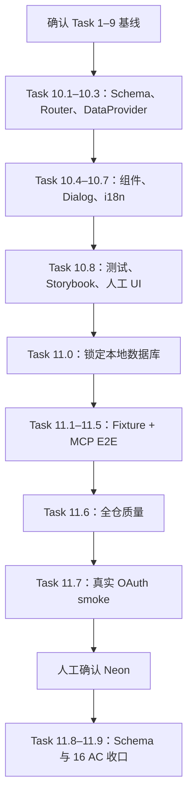

# COD-306 Task 10-11：剩余任务执行总览
> Last Format Time：8/13/2026 15:14:03

> **执行指引：** 本文只负责告诉你“先做什么、做到什么程度、什么时候停”。具体代码和测试见同目录两份详细计划。
> 步骤使用 checkbox (`- [ ]`) 追踪进度。

**目标：** 在不扩大首期 MCP 能力范围的前提下，完成 Settings 可视化、调用记录、双 Workspace E2E、真实 OAuth smoke 和 Neon Schema 验收。

**架构：** Task 10 完成“用户看得见”的 Settings 界面和只读查询；Task 11 完成“系统确实安全”的数据库/协议/授权验收。两者完成后，COD-306 的 16 条 AC 才算全部闭环。

**技术栈：** React、Refine、tRPC、Zod、Storybook、Vitest、MCP、PostgreSQL、Neon。

---
## 一、剩余范围只有 Task 10 和 Task 11
| 顺序 | 任务 | 主要产物 | 不允许提前做的事 |
|---|---|---|---|
| 1 | Task 10 | Connection Details 的 Available Tools / Invocation History | 不做 GitHub Delivery、PR、code write |
| 2 | Task 11 | 双 Workspace E2E、OAuth smoke、Neon Schema 验收 | 不在 Neon 运行 E2E seed/cleanup |

Task 10 依赖 Task 1–9；Task 11 依赖 Task 10 的 UI 和 Task 1–9 的完整 Tool 链路。因此不要并行实施这两个任务。

---
## 二、推荐执行节奏


---
## 三、每天开始前执行
```powershell
Set-Location 'G:\Save\Grogramming\CodeForge\daedalus'
git branch --show-current
git status --short
git log -5 --oneline
```

确认：

- 当前是 COD-306 功能分支。
- 没有不认识的改动。
- 不需要切回 develop 重做已经完成的 Task 1–9。
- 不使用 `git reset --hard`、`git checkout --` 清理用户改动。

---
## 四、Task 10 检查点
- [ ] 共享 Schema 已定义 Invocation 查询输入和返回类型。
- [ ] Router 先验 owner，再访问 Invocation DAO。
- [ ] 查询其他用户的 Connection 返回 `NOT_FOUND`。
- [ ] Available Tools 和 Invocation History 都走 Refine DataProvider。
- [ ] 页面专用组件留在 `AiReviewsSettingsPage`。
- [ ] Dialog 只组合 Overview、Available Tools、Invocation History。
- [ ] Metadata Tool 全部显示 Read。
- [ ] History 不显示 Tool 原始输入、Token、源代码或 raw trace。
- [ ] Consent/Setup 已删除“没有业务工具”的过期文案。
- [ ] AC-04、AC-08 的单测和 Storybook 通过。

详细步骤：[[COD-306 Task 10：Settings 工具目录与调用记录详细实现计划]]

---
## 五、Task 11 检查点
- [ ] E2E 有强制 localhost/daedalus 保护。
- [ ] User A 同时拥有 Workspace A/B，但 Connection A 固定到 A。
- [ ] Project B、Run B、Finding B 对 Connection A 都是泛化拒绝。
- [ ] 未确认 scan/finding write 无数据库副作用。
- [ ] 已确认 scan/finding write 有结果和审计。
- [ ] Trace 不包含 `rawContentRef`。
- [ ] Invocation audit 不包含 Token 或文件正文。
- [ ] revoked/membership lost 在 Tool 执行前被拒绝。
- [ ] 真实 Codex + 浏览器 OAuth smoke 通过。
- [ ] Neon 只进行 Schema push 和只读验证。
- [ ] 16 条 AC 都能指向测试、Story 或 smoke 证据。

详细步骤：[[COD-306 Task 11：双 Workspace E2E、OAuth 与 Neon 验收计划]]

---
## 六、提交边界
每个小节完成后只提交该小节代码：

```powershell
git status --short
git diff --check
git diff --cached --name-only
```

绝对不要提交：

- 本 Obsidian 文件夹中的文档。
- `docs/COD-306/plan.md`、`docs/COD-306/prd.md`。
- `.env` 或任何 Token/数据库密码。
- Task 10/11 范围外的顺手重构。

---
## 七、停止条件
遇到下面任一情况立即停下，不要凭感觉继续：

1. Task 1–9 的协议测试或类型检查失败。
2. Router 无法在 DAO 调用前验证 Connection owner。
3. E2E 的 `DATABASE_URL` 不是 localhost/daedalus。
4. Drizzle Neon push 提示删除、清空或重建现有表。
5. 真实 OAuth smoke 要求复制 access token、refresh token、cookie 或 client secret。
6. 工作区出现不属于当前小节的未知改动。

---
## 八、最终完成定义
只有同时满足以下条件，COD-306 才能结束：

- [ ] Task 10 的定向测试、App 类型检查、lint、全量测试和 Storybook build 通过。
- [ ] Task 11 本地 PostgreSQL E2E 通过且无 fixture 残留。
- [ ] 全仓 `quality`、`build`、`knip` 通过。
- [ ] 真实 OAuth smoke 通过。
- [ ] Neon 已存在 `mcp_tool_invocations` 表和两个业务索引。
- [ ] 16 条 AC 全部有证据。
- [ ] Git 提交中没有文档、凭证或 Task 10+ 之外的能力扩张。
