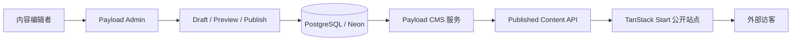

# Payload CMS 与 TanStack Start 公开内容架构
> Last Format Time：9/16/2026 19:24:55

> 本文整理 COD-362、COD-363 以及围绕 Payload CMS、TanStack Start、自有数据库和 Published Content API 的讨论。

---
## 一句话结论
我们正在实现一套**前后端独立部署的 Headless CMS 架构**：

- `apps/cms` 使用 **Payload CMS + Next.js**，负责内容模型、后台管理、草稿、发布、权限、媒体和公开读取 API。
- `apps/web` 使用 **TanStack Start**，负责面向访客的公开网站、SSR、路由和页面渲染。
- 两个应用通过项目自定义的 **Published Content API** 连接。
- 两者不直接共享运行时，也不要求公开网站使用 Next.js。
- Payload 使用我们自己的 PostgreSQL / Neon 数据库是正确用法，但需要明确 CMS 表的所有权和数据库隔离策略。



---
## COD-362 与 COD-363 分工
### COD-362：内容生产和发布
COD-362 负责解决“内容从哪里来、如何编辑、如何发布、公开端能读取什么”的问题。

主要能力包括：

- Payload CMS Admin。
- Page、Section Block、Navigation、Site Settings、Media、SEO 等内容模型。
- Draft、Published、Unpublished 生命周期。
- 编辑者和发布者权限。
- 发布前内容校验。
- 保存最近一次有效 Published 页面快照。
- 对外提供只读的 Published Content API。

该需求在 Linear 中已经完成，对应实现已合入 PR #76。

### COD-363：公开网站展示
COD-363 负责解决“访客如何浏览已经发布的内容”的问题。

主要能力包括：

- 新建独立的 `apps/web` TanStack Start 应用。
- 提供 `/`、`/$slug` 和公开 404 页面。
- 展示首页、Product、Use cases、FAQ、导航、页脚、CTA 和媒体。
- 只消费 Published 内容。
- 处理 loading、fallback、unpublished、not found 和 unavailable。
- 不接入内部 App 登录，也不持有 Payload 管理凭证。

截至 2026-08-25：

- Linear 状态仍是 `In Progress`。
- 本地 `docs/COD-363/plan.md` 已标记实现完成。
- 当前分支为 `feature/public-web`，本地领先远端 2 个提交。

因此，“需求管理状态”和“本地代码完成状态”目前并不完全一致，后续应以测试、部署和 PR 状态完成最终验收。

---
## Payload CMS 到底是什么
Payload CMS 3.x 可以运行在 Next.js 应用中。它不只是一个可视化后台，还提供：

- Admin 管理界面。
- 内容模型和字段配置。
- 权限控制。
- Draft、Versions 和发布工作流。
- Local API。
- REST API 和 GraphQL API。
- 数据库 Adapter。
- 文件上传和媒体处理。
- 自定义 Endpoint。

所以 Payload 官网将其描述为基于 Next.js 的全栈框架是合理的。

但“Payload 能够承载完整 Next.js 网站”不等于“使用 Payload 时，前台必须使用 Next.js”。

Payload 同时支持 Headless 模式。我们可以只把它当作内容管理服务，再让任意前端框架通过 HTTP API 消费内容。当前让 TanStack Start 作为独立公开前端，就是这种用法。

---
## 当前使用 Payload 的方式是否正确
结论是：**整体架构正确，而且符合 Payload 支持的 Headless 使用方式。**

当前 `apps/cms` 的关键配置包括：

```ts
export default withPayload(nextConfig, {
  devBundleServerPackages: false,
})
```

Next.js 的 `(payload)` Route Group 承载：

- `/admin`
- `/api/[...slug]`
- GraphQL
- GraphQL Playground

`payload.config.ts` 使用：

```ts
db: postgresAdapter({
  pool: {
    connectionString: env.DATABASE_URL,
  },
  push: false,
})
```

这表示：

- Payload 运行在标准 Next.js 应用内。
- Payload 通过 PostgreSQL Adapter 连接我们配置的数据库。
- 生产环境不自动推送 Schema，而是使用正式迁移。
- Payload Admin、内容服务和公开 API 都属于 `apps/cms`。

`apps/web` 并没有嵌入 Payload，也没有依赖 Next.js。它只知道 CMS 的公开地址：

```text
PUBLIC_CMS_URL=http://localhost:9433
```

因此项目中存在两个独立应用：

| 应用 | 框架 | 职责 | 本地端口 |
|---|---|---|---|
| `apps/cms` | Payload CMS + Next.js | 内容管理、发布、API | `9433` |
| `apps/web` | TanStack Start | 公开网站、SSR、路由、渲染 | `9432` |

---
## 两个应用是怎么连接起来的
它们通过 HTTP API 连接，不通过数据库直连，也不通过 React 组件互相引用。

### CMS 暴露公开读取端点
当前有两个项目自定义端点：

```http
GET /api/public/site
GET /api/public/pages/:slug
```

- `/api/public/site` 返回公开站点设置和导航。
- `/api/public/pages/:slug` 返回指定 slug 的公开页面。

这些 Endpoint 注册在 Payload 配置中：

```ts
endpoints: [publicPageEndpoint, publicSiteEndpoint]
```

Endpoint 内部使用 `req.payload` 调用 Payload Local API，然后交给项目自己的 Service 处理发布规则。

### CMS 将内部数据转换为公开数据
Payload 的原始文档包含很多前台不需要知道的字段，例如：

- 草稿和版本字段。
- 内部数据库 ID。
- 管理关系。
- Payload 自动生成的元数据。
- 编辑权限和管理状态。

公开 API 不直接把原始 Payload 文档透传给前端，而是通过 Mapper 转换成 `PublicPage`、`PublicSiteContent` 等公开模型。

这些模型由 `@repo/schemas` 中的 Zod Schema 统一定义，CMS 和 Web 共享同一个数据契约。

### TanStack Start 在服务端请求 CMS
`apps/web` 使用 TanStack Start `createServerFn` 读取 CMS：

```ts
fetchPublicSiteDelivery(`${PUBLIC_CMS_URL}/api/public/site`)

fetchPublicPageDelivery(
  `${PUBLIC_CMS_URL}/api/public/pages/${encodeURIComponent(slug)}`,
)
```

请求返回后，Web 会再次使用共享 Zod Schema 校验响应。

如果发生以下情况，会统一转成 `unavailable`：

- 网络请求失败。
- 返回内容不是合法 JSON。
- 返回结构不符合共享 Schema。
- HTTP 状态与 delivery status 自相矛盾。

这使 TanStack Start 不需要理解 Payload 的内部数据结构，也不会因为 CMS 内部字段变化而直接崩溃。

### 页面根据 delivery status 渲染
Web 不把“HTTP 请求成功”简单等同于“页面可以正常展示”，而是读取明确的业务状态：

| status | HTTP | 含义 | Web 行为 |
|---|---:|---|---|
| `published` | 200 | 当前 Published 内容有效 | 正常显示 |
| `fallback` | 200 | 当前读取失败，但存在最近有效快照 | 显示快照和降级提示 |
| `unpublished` | 410 | 页面存在但已下线或未发布 | 显示公开 404/替代页 |
| `not_found` | 404 | 页面不存在 | 显示公开 404 |
| `unavailable` | 503 | CMS、数据库或数据解析不可用 | 显示服务不可用 |

---
## Published Content API 是什么
**Published Content API 不是 Payload 官方某个固定产品或内置模块的名称。**

它是我们项目自己定义的一层“公开内容交付边界”，底层使用 Payload 的自定义 Endpoint 和 Local API 实现。

它的核心职责不是单纯“从 CMS 查询数据”，而是保证：

1. Draft 不会泄漏到公开网站。
2. 未发布或已下线页面不会继续作为正常页面展示。
3. Payload 内部字段不会成为公开前端依赖。
4. CMS 和 Web 使用同一套 Zod 数据契约。
5. 数据库或内容转换失败时保留明确语义。
6. 必要时返回最后一次有效的 Published 快照。
7. Web 不需要数据库权限或 Payload 管理凭证。

可以将它理解为：

```text
Payload 内部数据
    ↓ 发布规则、权限和数据转换
稳定的公开内容 DTO
    ↓ HTTP + Zod
TanStack Start 页面
```

它不是 CRUD 管理 API，也不是给 Admin 使用的 API，而是专门面向公开网站的只读 Delivery API。

---
## 为什么不让 TanStack Start 直接查数据库
公开 Web 直接查询 CMS 数据库会产生几个问题：

- Web 必须理解 Payload 自动生成的表结构。
- Web 可能绕过 Draft 和 Published 规则。
- Web 需要持有数据库凭证。
- Payload 升级或迁移会直接影响 Web。
- CMS 数据模型和公开页面模型无法解耦。
- fallback、410、404、503 等业务语义会散落到页面代码。

现在的 API 边界把这些规则集中放在 CMS 侧。TanStack Start 只消费已经筛选、转换和校验过的数据，这是更清晰的职责划分。

---
## 使用自己的数据库是否正确
正确。Payload 不要求使用 Payload Cloud 托管数据库。通过 `@payloadcms/db-postgres` 连接我们自己的 PostgreSQL 或 Neon，是标准使用方式。

需要区分两件事：

### 数据库是我们的
- PostgreSQL / Neon 实例由我们配置和运维。
- 连接地址通过 `DATABASE_URL` 注入。
- 数据备份、区域、权限和容量由我们负责。

### CMS 表由 Payload 管理
- Payload 根据 Collection、Global、Draft、Version 等配置生成表结构。
- Payload 的表应通过 Payload migration 管理。
- 不应让业务 Drizzle Schema 手工重复定义或修改 Payload 管理的表。

当前迁移会创建 `pages`、`media`、`payload_migrations`、`site_navigation` 等未指定 schema 的表，因此默认进入 PostgreSQL 的 `public` schema。

如果 Payload 与 Daedalus 主业务表使用同一个 Neon database，这在技术上可行，但长期会增加：

- 表命名冲突风险。
- 迁移所有权不清晰。
- 最小权限难以控制。
- CMS 与主业务数据库生命周期耦合。
- 备份、恢复和迁移范围变大。

更推荐以下两种方式之一：

1. **独立 Neon database / project**：隔离最清楚，适合生产。
2. **同一 PostgreSQL database，独立 `payload` schema**：成本更低，但仍要分离迁移和权限。

注意：当前已经存在未指定 schema 的 Payload migration。不能只在配置中直接加 `schemaName: "payload"` 后上线，否则旧表和新表的位置会不一致。需要先设计并验证正式迁移。

---
## 生产部署必须补齐的事项
### 执行 Payload migration
当前设置了 `push: false`，这是生产环境更稳妥的配置，但部署流水线必须明确执行：

```bash
bun --cwd apps/cms run db:migrate
```

否则代码上线后，数据库结构可能没有同步。

### 将媒体迁移到对象存储
当前 `Media` Collection 使用：

```ts
staticDir: path.resolve(dirname, "../../media")
```

这表示上传文件保存在 CMS 服务器本地磁盘。若部署到无状态或临时文件系统，重启、扩缩容或重新部署后文件可能丢失，多个实例之间也无法共享文件。

生产环境应改用持久对象存储，例如：

- Amazon S3。
- Cloudflare R2。
- Vercel Blob。
- 其他 S3 兼容存储。

PostgreSQL 主要保存媒体元数据，不应依赖它保存本地图片文件本身。

### 保持公开 API 的服务端读取
当前 TanStack Start 通过 Server Function 请求 CMS，这样：

- 浏览器不需要知道数据库或 Payload Secret。
- 服务端之间通信通常不受浏览器 CORS 限制。
- CMS 地址和错误处理可以集中管理。

不要把 Payload 管理 Token 或数据库凭证放入浏览器环境变量。

### 保持缓存与状态一致
CMS 只对 `published` 和 `fallback` 响应设置公开缓存：

```text
public, max-age=60, s-maxage=300,
stale-while-revalidate=3600, stale-if-error=86400
```

`unpublished`、`not_found`、`unavailable` 使用 `no-store`，避免错误或下线状态被长期缓存。

---
## 这套架构的边界
### Payload CMS 负责
- 后台和内容编辑体验。
- 内容 Schema。
- Draft、Preview、Publish、Unpublish。
- 发布权限和发布校验。
- 内容持久化。
- Published 快照。
- 公开内容 DTO 的生成。
- Delivery API 的状态、缓存和 HTTP 语义。

### TanStack Start 负责
- 公开路由。
- SSR 和页面加载。
- 响应式布局。
- 页面区块渲染。
- loading、404、fallback、unavailable UI。
- 对 API 响应执行 Zod 校验。
- 面向访客的导航和交互。

### 两者都不应该做
- Web 不直接读取 CMS 数据库。
- Web 不持有 CMS 管理权限。
- CMS 不负责公开站点的完整 UI 和路由体验。
- 公共 API 不返回 Draft。
- 不把 Payload 生成的内部类型直接当作公开 API 契约。

---
## 当前关键代码位置
### Payload CMS
- `apps/cms/src/payload.config.ts`
- `apps/cms/next.config.mjs`
- `apps/cms/src/collections/Pages.ts`
- `apps/cms/src/collections/Media.ts`
- `apps/cms/src/endpoints/publicPageEndpoint.ts`
- `apps/cms/src/endpoints/publicSiteEndpoint.ts`
- `apps/cms/src/endpoints/createPublicDeliveryResponse.ts`
- `apps/cms/src/services/publicContentService.ts`

### TanStack Start
- `apps/web/src/lib/public-content/loadPublicContent.ts`
- `apps/web/src/lib/public-content/fetchPublicDelivery.ts`
- `apps/web/src/routes/`

### 共享契约
- `packages/schemas/src/public-content/`
- `packages/schemas/src/public-content/PublicContentDeliveryStatusValues.ts`

### 需求与计划
- `docs/COD-363/prd.md`
- `docs/COD-363/plan.md`

---
## 最终判断
当前方向不是“在 TanStack Start 里面使用 Payload 的 Next.js”，也不是“让两个前端框架拼在一起”。

准确说法是：

> Payload CMS 作为独立的 Next.js 内容服务运行，TanStack Start 作为独立的公开 Web 运行；两者通过自定义 Published Content API 和共享 Zod Schema 通信。

这套架构是合理的。后续最重要的工程事项不是替换框架，而是：

1. 明确 Payload 数据库的隔离方式。
2. 把 Payload migration 加入部署流水线。
3. 把媒体从本地磁盘迁移到对象存储。
4. 保持 Published Content API 是公开 Web 唯一的 CMS 读取边界。

---
## 参考
- [Payload Documentation](https://payloadcms.com/docs)
- [Payload REST API](https://payloadcms.com/docs/rest-api/overview)
- [Payload Local API](https://payloadcms.com/docs/local-api/overview)
- [Payload PostgreSQL Adapter](https://payloadcms.com/docs/database/postgres)
- [Payload Custom Endpoints](https://payloadcms.com/docs/rest-api/overview#custom-endpoints)
- [TanStack Start Documentation](https://tanstack.com/start/latest)
