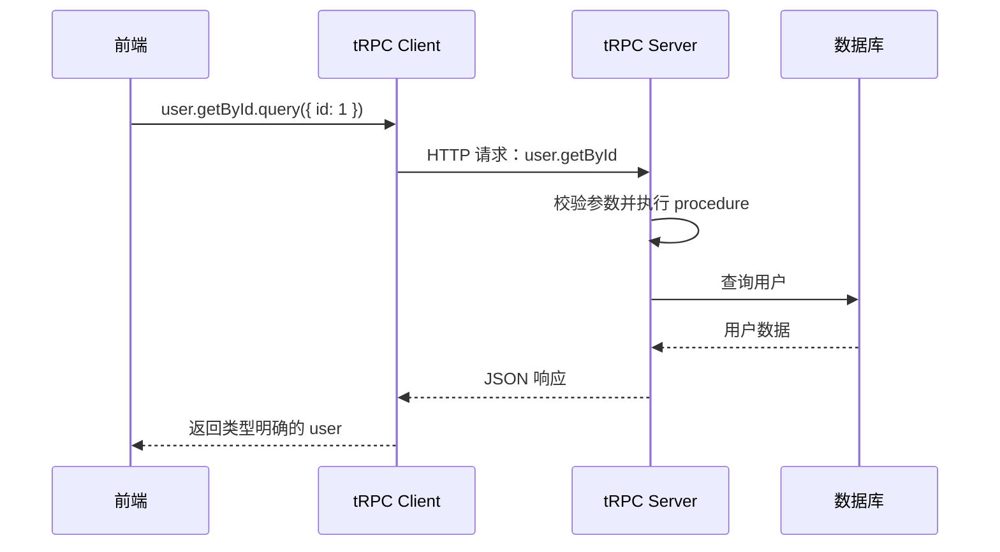

# tRPC简述 
是一个 TypeScript 优先的 RPC（Remote Procedure Call） 框架，核心卖点是 端到端类型安全

[[useQuery]]
[[用neverthrow进行错误处理]]

---
## 简述
RPC 是 **Remote Procedure Call（远程过程调用）**。它让前端调用后端接口时，看起来像是在调用一个普通函数。

以 tRPC 为例：

```ts
const user = await trpc.user.getById.query({ id: 1 });
```

看起来是函数调用，但实际上背后依然会发送 HTTP 请求。

## 一次 tRPC 调用经历了什么



### 1. 后端定义函数

在 tRPC 中，这种可以被前端调用的函数叫做 `procedure`。

```ts
import { initTRPC } from "@trpc/server";
import { z } from "zod";

const t = initTRPC.create();

export const appRouter = t.router({
  user: t.router({
    getById: t.procedure
      .input(
        z.object({
          id: z.number(),
        }),
      )
      .query(({ input }) => {
        return {
          id: input.id,
          name: "Dano",
        };
      }),
  }),
});

export type AppRouter = typeof appRouter;
```

这里定义了一个调用路径：

```text
user.getById
```

`tRPC` 将 procedure 分为：

- `query`：查询数据
    
- `mutation`：新增、修改、删除数据
    
- `subscription`：持续接收数据
    

这是官方定义的核心模型。[tRPC Procedures 文档](https://trpc.io/docs/server/procedures)

### 2. 前端引入后端的类型

```ts
import { createTRPCClient, httpBatchLink } from "@trpc/client";
import type { AppRouter } from "./server";

const trpc = createTRPCClient<AppRouter>({
  links: [
    httpBatchLink({
      url: "http://localhost:3000/trpc",
    }),
  ],
});
```

然后调用：

```ts
const user = await trpc.user.getById.query({
  id: 1,
});
```

此时编辑器会自动知道：

```ts
user.name; // string
user.id;   // number
```

如果参数写错：

```ts
trpc.user.getById.query({
  id: "1", // TypeScript 报错：应该是 number
});
```

## 为什么没有真的导入后端代码？

这里：

```ts
import type { AppRouter } from "./server";
```

只导入了 TypeScript 类型。

编译完成后，`AppRouter` 会被删除，不会把数据库代码或后端实现打包到浏览器里。

客户端内部使用 JavaScript `Proxy`，记录访问路径：

```ts
trpc.user.getById.query(...)
```

大致会被转换成：

```ts
fetch("/trpc/user.getById?input=...")
```

服务端根据 `user.getById` 找到对应 procedure，执行以后返回 JSON。官方也说明 tRPC Client 底层会创建一个带类型的 JavaScript Proxy。[tRPC Client 文档](https://trpc.io/docs/client/vanilla/setup)

## tRPC 和 REST 的区别

|REST|tRPC|
|---|---|
|`GET /api/users/1`|`user.getById.query({ id: 1 })`|
|自己维护请求和响应类型|从服务端自动推导类型|
|通常使用 `fetch`/Axios|使用 tRPC Client|
|适合多种语言调用|最适合前后端都是 TypeScript|
|接口以 URL 和 HTTP 方法为中心|接口以函数/procedure 为中心|

tRPC 最大的特点不是“没有 HTTP”，而是：

> 它把 HTTP 请求包装成了类型安全的函数调用。

不过要注意，TypeScript 类型只在编译阶段有效，所以仍然需要 Zod 等工具校验真实请求参数。tRPC 官方也明确支持通过 input parser 做运行时校验。[tRPC 快速入门](https://trpc.io/docs/quickstart)

简单总结：

```text
REST：前端根据接口文档调用后端
tRPC：前端直接复用后端导出的类型来调用后端
```

因此 tRPC 特别适合同一个团队维护的全栈 TypeScript 项目，例如 React/Next.js + Node.js；如果后端还要提供给 Java、Python、移动端或第三方调用，REST、GraphQL 往往更通用。[tRPC 官方介绍](https://trpc.io/docs/)

---
## 具体实现
```js
import { createFileRoute } from "@tanstack/react-router";
import { fetchRequestHandler } from "@trpc/server/adapters/fetch";
import { appRouter } from "@/integrations/trpc/router";
import { auth } from "@/integrations/better-auth/auth";

const handleRequest = async (request: Request) => {
  const session = await auth.api.getSession({ headers: request.headers });

  return fetchRequestHandler({
    endpoint: "/api/trpc",
    req: request,
    router: appRouter,
    createContext: () => ({
      session: session ?? null,
    }),
  });
};

export const Route = createFileRoute("/api/trpc/$")({
  server: {
    handlers: {
      GET: ({ request }) => handleRequest(request),
      POST: ({ request }) => handleRequest(request),
    },
  },
});

// 这个文件 = TanStack Start 的路由文件，负责接收所有 /api/trpc/* 请求 → 提取用户身份 → 转交 tRPC 处理。项目里所有的增删改查接口都走这一个门进来。
```

### 第 1-4 行：导入依赖
```typescript
import { createFileRoute } from "@tanstack/react-router";  // TanStack Start 的文件路由
import { fetchRequestHandler } from "@trpc/server/adapters/fetch"; // tRPC 的请求处理器
import { appRouter } from "@/integrations/trpc/router";  // 所有 API 接口的定义
import { auth } from "@/integrations/better-auth/auth";  // 登录认证模块
```

- **`createFileRoute`**：TanStack Start 的约定——文件放在 `routes/api/trpc.$.ts`，自动映射到 `/api/trpc/*` 路由。那个 `$` 是**通配符**，匹配 `/api/trpc/` 后面所有路径。
- **`fetchRequestHandler`**：tRPC 提供的工具函数，把原始的 HTTP 请求翻译成 tRPC 能理解的格式。
- **`appRouter`**：所有业务接口的集合（rules、runs、findings 等），就像一个"接口菜单"。
- **`auth`**：Better Auth 实例，用来检查请求是谁发的。

### 第 6-17 行：核心处理函数
```typescript
const handleRequest = async (request: Request) => {
  // 1️⃣ 从请求头里提取 session，判断用户是否登录
  const session = await auth.api.getSession({ headers: request.headers });

  // 2️⃣ 把请求交给 tRPC 处理
  return fetchRequestHandler({
    endpoint: "/api/trpc",           // API 前缀
    req: request,                     // 原始请求
    router: appRouter,                // 接口菜单
    createContext: () => ({
      session: session ?? null,       // 用户信息（未登录就是 null）
    }),
  });
};
```

流程：
1. **鉴权**：从 HTTP 请求头里提取 session → 知道是谁在调用
2. **转发**：把请求、session、路由表一起交给 tRPC，让它找到对应的接口并执行

### 第 19-26 行：注册路由
```typescript
export const Route = createFileRoute("/api/trpc/$")({
  server: {
    handlers: {
      GET: ({ request }) => handleRequest(request),   // GET 请求走这里
      POST: ({ request }) => handleRequest(request),  // POST 请求走这里
    },
  },
});
```

告诉 TanStack Start："凡是发到 `/api/trpc/*` 的 GET 或 POST 请求，都交给 `handleRequest` 处理"。

---
## 为什么用 `$` 而不是具体路径？
tRPC 的所有接口共用这一个端点（不像传统 REST 那样 `/api/users`、`/api/posts` 各一个路由）。tRPC 通过请求体里的内容区分调用哪个接口，所以 URL 只需要一个通配入口。

---
### query与mutation

getById: publicProcedure                                                                                                                          
          .input(z.object({ id: z.string() }))                                                                                                          
          .query(async ({ input }) => {                                                                                                                 
              const svc = createAnatomiesService(db);                                                                                                   
              const result = await svc.getById(input.id)                                                                                                
              return result.match(                                                                                                                      
                  (data) => data,                                                                                                                       
                  (error) => { throw new Error(error.message) },                                                                                        
              )                                                                                                                                         
          }),                                                                                                                                           
                                                                                                                                                        
      createDraft: publicProcedure                                                                                                                      
          .input(anatomyDraftInputSchema)                                                                                                               
          .mutation(async ({ input }) => {                                                                                                              
              const svc = createAnatomiesService(db);                                                                                                   
              const result = await svc.createDraft(input)                                                                                               
              return result.match(                                                                                                                      
                  (data) => data,                                                                                                                       
                  (error) => { throw new Error(error.message) },                                                                                        
              )                                                                                                                                         
          }), 这里的query与mutation有什么区别                                                                                                           

  Thought for 15s (ctrl+o to expand)

● 这是 tRPC 中两种最基础的 procedure 类型，区别和 HTTP 语义里的 GET / POST 类似：
  
  ┌───────────┬────────────────────────────────┬──────────────────────────────────────┐
  │           │             query              │               mutation               │
  ├───────────┼────────────────────────────────┼──────────────────────────────────────┤
  │ 用途      │ 读取数据                       │ 写入/修改数据                        │
  ├───────────┼────────────────────────────────┼──────────────────────────────────────┤
  │ 幂等性    │ 应当无副作用、可重复调用       │ 会改变服务器状态                     │
  ├───────────┼────────────────────────────────┼──────────────────────────────────────┤
  │ 典型场景  │ 查详情、列表、搜索             │ 创建、更新、删除                     │
  ├───────────┼────────────────────────────────┼──────────────────────────────────────┤
  │ 调用方式  │ useQuery / trpc.xxx.useQuery() │ useMutation / trpc.xxx.useMutation() │
  ├───────────┼────────────────────────────────┼──────────────────────────────────────┤
  │ HTTP 映射 │ 近似 GET                       │ 近似 POST/PUT/DELETE                 │
  └───────────┴────────────────────────────────┴──────────────────────────────────────┘

  对应你这段代码：

  getById: publicProcedure
      .input(z.object({ id: z.string() }))
      .query(async ({ input }) => { ... }),

  - 用 query，因为 getById 只是根据 id 读取一个 anatomy，不会修改数据。

  createDraft: publicProcedure
      .input(anatomyDraftInputSchema)
      .mutation(async ({ input }) => { ... }),

  - 用 mutation，因为 createDraft 会创建一条新记录，属于写操作。

  简单说

  - 查东西 → query
  - 改东西 → mutation

  前端调用时也要对应：getById 用 useQuery（会自动缓存、重试），createDraft 用 useMutation（手动触发，配合 onSuccess 做刷新或跳转）。

---
## code
```ts
import { z } from "zod/v4";
import { db } from "@repo/db";
import { createCratesService } from "@repo/services";
import { router, publicProcedure, authedProcedure } from "../init";
import { crateCreateSchema, crateUpdateSchema } from "./schemas";

export const cratesRouter = router({
  list: publicProcedure
    .input(
      z.object({
        search: z.string().optional(),
        page: z.number().optional(),
        pageSize: z.number().optional(),
      }),
    )
    .query(async ({ input }) => {
      const svc = createCratesService(db);
      const result = await svc.list(input);

      return result.match(
        (data) => data,
        (error) => {
          throw new Error(error.message);
        },
      );
    }),

  getById: publicProcedure
    .input(z.object({ id: z.string() }))
    .query(async ({ input }) => {
      const svc = createCratesService(db);
      const result = await svc.getById(input.id);

      return result.match(
        (data) => data,
        (error) => {
          throw new Error(error.message);
        },
      );
    }),

  create: authedProcedure
    .input(crateCreateSchema)
    .mutation(async ({ input }) => {
      const svc = createCratesService(db);
      const result = await svc.create(input);

      return result.match(
        (data) => data,
        (error) => {
          throw new Error(error.message);
        },
      );
    }),

  update: authedProcedure
    .input(z.object({ id: z.string(), patch: crateUpdateSchema }))
    .mutation(async ({ input }) => {
      const svc = createCratesService(db);
      const result = await svc.update(input.id, input.patch);

      return result.match(
        (data) => data,
        (error) => {
          throw new Error(error.message);
        },
      );
    }),

  delete: authedProcedure
    .input(z.object({ id: z.string() }))
    .mutation(async ({ input }) => {
      const svc = createCratesService(db);
      const result = await svc.delete(input.id);

      return result.match(
        (data) => data,
        (error) => {
          throw new Error(error.message);
        },
      );
    }),
});

```